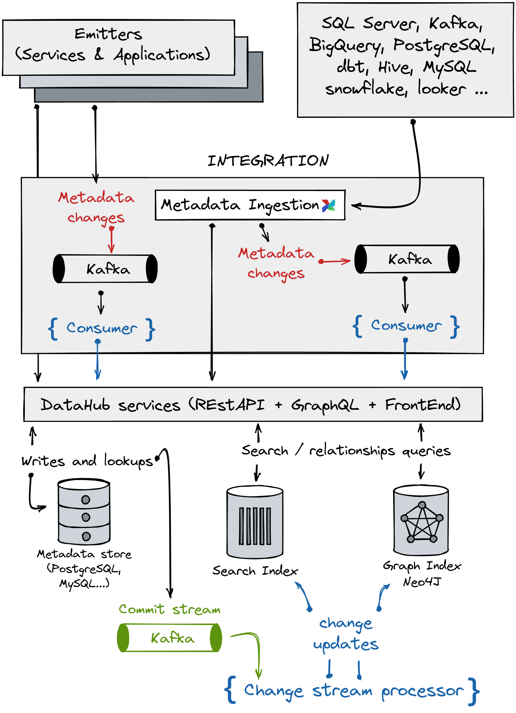

Let's imagine you are a freshly recruited Data Scientist. During one of your stand-up, your product owner gives you a couple of tasks that implies interacting with several data sources. You quickly realize that your main challenge here, even before fulfilling your task will be first to know your data:

- Where is the data located? Cloud? On-premise?
- Where is it stored? In a data lake? A relational database?
- What is the schema of the data assets you need to use?
- Do you have permissions to access it? If not, who is the owner of the data?
- Are there any sensitive data that you should be aware of?
- How can you know the history of the data? Is the data a result of several processing steps? in other words what is its lineage?

We could continue here the list of questions one might ask when dealing with data assets inside a company. To be able to answer these, you could ask your colleagues. While this could work in a small working environment dealing with small amount, this approach is challenging in bigger companies that manage data at big scale.

To solve this particular problem and give more transparency to the way data flows inside a company, several tools propose to collect data about your data assets and contextualize it. These tools are called metadata hubs and provide ways to implement:

- A **data catalog** to organize data assets inside companies to facilitate the discovery, management, and tracking of the data.
- A **data lineage** framework to trace and track how data flows around your system.
- A **data quality** system to define rules that assess and evaluate the accuracy of your data. Often organizations inaccuracy in your data is identified too late and this might cause issues.

Here we will present you the different metadata hubs solutions available in the open-source ecosystem. We will see the type of architecture they rely on and what specific problems they aim to solve by highlighting their strengths and weaknesses.

## The metadata hubs ecosystem

Metadata hub is not a new concept. But it attracted all attention in the last decade. Some well-established companies propose paid solutions to collect and process your metadata. For example, [Alation](https://www.alation.com/), [Collibra](https://www.collibra.com/), and [Data.World](https://data.world/) proposed software as a service solutions with advanced data catalog and lineage features. Cloud providers started to include hubs that process metadata from their services in their offer. Azure has Azure [Purview](https://azure.microsoft.com/en-us/services/purview/), Google Cloud has [Data Catalog](https://cloud.google.com/data-catalog) and, Amazon has the AWS Glue data catalog. The open-source community witnessed the emergence of promising tools: [Amundsen](https://www.amundsen.io/), [Marquez](https://marquezproject.github.io/marquez/), [Apache Atlas](https://atlas.apache.org/#/), and [LinkedIn's DataHub](https://datahubproject.io/).

Alternatives are not lacking. But which one should you choose? Which one should you implement to fit your needs and expectations in terms of data governance? There is one fundamental technical criterion to guide you in your decision: the technical architecture the solution is built upon. An [article published by LinkedIn](https://engineering.linkedin.com/blog/2020/datahub-popular-metadata-architectures-explained) described three types of metadata hubs architectures. Here, we will go through each of them and discuss their advantages and trade-offs. For each architecture, we will report our own experience with some of the open-source tools available.

### The type 1 architecture: a monolithic approach

*Figure 1:* Type 1 architecture: reproduced and modified from [here](https://engineering.linkedin.com/blog/2020/datahub-popular-metadata-architectures-explained)

The first-generation metadata hub consists of a monolithic application connected to a primary metadata store. Sometimes the metadata stored in the primary store is duplicated to be used as a search index. In practice, metadata is imported from your different data sources or ETL logs using an orchestrator such as [Airflow](https://airflow.apache.org/).

This type of metadata hub is easy to set up and maintain. However, it provides limited features (mainly data cataloging) without programmatic access. Additionally, extra care is required to avoid any resource overflow of your own data infrastructure (loading data in batch cost resources and can seriously slow down other processes). Finally, periodic batch loads of your metadata cannot guarantee an always consistent metadata.

### Amundsen

The open-source data catalog Amundsen is a typical example of a type-1 architecture. It uses the [databuilder](https://github.com/amundsen-io/amundsen/tree/main/databuilder) library to ingest, transform metadata from [several sources](https://github.com/amundsen-io/amundsen/tree/main/databuilder/databuilder/extractor) and load it into a metadata store. Different choices can be made here for the storage solution: Neo4j, Apache Atlas, AWS Neptune, or Mysql. The main functionality of Amundsen is data cataloging coupled with an ergonomic UI enabling the user to search for descriptions of tables and columns, table usage frequency, or table statistics. No functionality related to data lineage of quality is available in this solution.

Despite its limited features, Admunsen remains a solid choice for data cataloging your data assets. Indeed, if your company remains small and you want to provide an easy interface for your Data Analyst and Scientist to search and track specific data assets, go for it. To see a more practical demonstration of this tool, you can watch our related [Tour de Tools](https://www.youtube.com/watch?v=HK1A-yY2Yd4&list=PLPrO9x02oC5tgmbIPLZxmLIjLT2ZXupTq&index=2).

### The type 2 architecture: a programmatic approach

*Figure 2:* Type 2 architecture: reproduced and modified from [here](https://engineering.linkedin.com/blog/2020/datahub-popular-metadata-architectures-explained)

One limitation with the type-1 architecture is the impossibility to enable programmatic use cases (no access to the RestAPI). Type-2 metadata hubs solve this specific problem. The monolithic application is composed of three main pieces:

- the metadata store
- the metadata service, a Rest-API that process HTTP requests
- the front-end application that serves as a graphical interface to send requests to the metadata service

The Rest-API enables the data engineer to own his metadata. Indeed, by capitalizing on the API, one can build several connectors and integrators libraries that would automatically scrape database and orchestrator metadata during data processing. By doing so, such a solution can leverage the metadata to build an advanced lineage graph that traces the history of your data assets.

One limitation of this architecture is the lack of a changelog repository that captures all metadata changes and updates your search indexes accordingly. Some solutions do propose an approach to version your jobs but, it does not store the full history of metadata changes and has no update process to keep it always fresh.

Finally, keep in mind that such a system might not scale well, especially if you are dealing with real (and we insist on this) big data. By not being distributed you might face some scalability and reliability issues with such solutions.

### Marquez

*Figure 3:* Marquez architecture and API

The open-source solution Marquez is a metadata hub built following the type-2 design. The metadata service is a Java server that process API HTTP requests coming from three different [endpoints](https://marquezproject.github.io/marquez/openapi.html):

- Core: for reading and writing processes.
- Search: for (and as its name states) searching data.
- Lineage: for extracting lineage data from several data sources and ETL tools.

Integrators are libraries coded to extract metadata from [different sources](https://openlineage.io/integration), including Airflow, [Spark](https://spark.apache.org/), and [dbt](https://www.getdbt.com/). API calls are formatted using the [OpenLineage](https://github.com/OpenLineage/OpenLineage) standard. With Airflow, you can collect job and datasets metadata from [PostgreSQL](https://www.postgresql.org/), [Google BigQuery](https://cloud.google.com/bigquery), [AWS Redshift](https://aws.amazon.com/redshift/), [Snowflake](https://www.snowflake.com/), and [Great Expectations](https://greatexpectations.io/).

The graphical interface of Marquez fetches metadata and outputs it in the form of tables and lineage graphs. However, the UI capability is pretty limited compared to a tool like Collibra, another type-2 metadata hub. Marquez does not provide a graphical interface to write or update metadata. Instead, Marquez is designed for "coding people" and might refrain business stakeholders.

To conclude, we think that Marquez is an interesting tool to start mastering and owning your metadata to implement a data governance strategy. Indeed, Marquez provides a data catalog, advanced data lineage, and security features in one place. Noteworthy, Marquez revealed to be simple to set up and use during our investigations. The documentation is thorough. The community behind it is active and responsive on their slack channel. To learn more about Marquez, we recommend you to watch our RootsConf [presentation](https://www.youtube.com/watch?v=L9B4wty7pWE&list=PLPrO9x02oC5v4caWb9MJzUQfxUMsjmZ-T&index=3) about metadata hubs.

### The type 3 architecture: a distributed approach

*Figure 4:* Type 3 architecture: reproduced and modified from [here](https://engineering.linkedin.com/blog/2020/datahub-popular-metadata-architectures-explained)

The third-generation tool relies on a distributed architecture. It provides several ways to lift metadata from services and data sources:

- Using a pull approach with a metadata ingestion library (not shown in the schema above)
- Using a push approach with Kafka streams or a Rest-API

One major advantage of theses systems is their ability to capture and process metadata changes. Any changes made to your data sources or jobs generate some metadata **change logs**. These are pushed/committed into the appropriate metadata services to be processed. Changes are then applied to the appropriate metadata stores or indexes. The ability to process and update changes is the main evolution provided by this type of metadata hub.

Do not forget that complexity comes as the main trade-off here. Such solutions require a lot of engineering and maintenance power to make them work in your company.

### Apache Atlas

**Figure 5:** Apache Atlas architecture: reproduced and modified from [here](https://developer.ibm.com/articles/apache-atlas-and-janusgraph-graph-based-meta-data-management/)

Apache Atlas is a data Governance and metadata framework for Hadoop. It is tightly coupled with the Hadoop ecosystem. Noteworthy, Purview is built on top of Apache Atlas and provides metadata governance and management capabilities with Azure data services.

Metadata is sent from different sources using [Kafka](https://kafka.apache.org/) messaging or REST-API calls. The **ingest / export** component consumes metadata pushed by Kafka and captures change events. These are then exported and committed to the right store or service.

To manage your metadata with Apache Atlas, you need to comply with its [type system](https://atlas.apache.org/2.0.0/TypeSystem.html). This system is flexible but complex to handle. By default, [Hadoop](https://hadoop.apache.org/) components are modeled accordingly but, you can define your types to add custom resources if needed. However, understanding the concepts of the type system component is not an easy task and, the learning curve might be stiff. Consequently, it may take a long time to harness the power of Apache Atlas.

The metadata objects (which are Java objects) are stored internally using [Janus Graph](https://janusgraph.org/). It enables efficient management of relationships between the metadata objects and works as an interface to translate between types and entities of the Atlas type system. The graph component permits holding lineage metadata information.

Two main applications consume metadata processed by Atlas:

- Atlas admin UI to discover and annotate metadata with business knowledge. It provides a search interface and, SQL is used to query the metadata types and objects. The UI is quite complete but can be overwhelming for new users. ING Bank recently discussed how they modernized their Apache Atlas setup by combining it with Amundsen. It notably abstracts away Atlas' complexity to facilitate data discovery and management by their Data Analysts and Scientists.
- Apache Ranger to define metadata-driven security and access permissions to protect your data assets.

Our investigations revealed that Apache Atlas was quite complex to apprehend. You will need a subsequent amount of time to handle the type system properly. Moreover, although you can spin up all Atlas components using a docker image, you cannot do much with it unless you have a Hadoop cluster around. Some custom connectors or integrators for other data sources are available in the open-source system nut remains scare. As such, you will need to invest a lot of time to integrate your non-Hadoop data sources.

In conclusion, we think that Apache Atlas is worth investing in if your company heavily relies upon Hadoop services and applications and under the condition you have the engineering power to manage and maintain its infrastructure. To learn more about Apache and its type system, we recommend you to watch our RootsConf [presentation](https://www.youtube.com/watch?v=L9B4wty7pWE&list=PLPrO9x02oC5v4caWb9MJzUQfxUMsjmZ-T&index=3) about metadata hubs.

### LinkedIn DataHub

**Figure 6:** DataHub architecture, reproduced and modified from [here](https://datahubproject.io/docs/architecture/architecture)

DataHub is LinkedIn's answer to provide a scalable and always consistent metadata hub. It harbors a flexible architecture to ingest metadata following two main approaches:

- A pull approach with an [ingestion system](https://datahubproject.io/docs/metadata-ingestion) that collects metadata from several sources. The metadata is pushed via Kafka or HTTP calls to the appropriate service or storage. You can use Airflow to orchestrate the ingestion pipelines.
- A push approach using direct API HTTP calls or Kafka streams. Metadata pushed by Kafka are processed by a consumer ([mce-consumer-job](https://github.com/linkedin/datahub/blob/master/metadata-jobs/mce-consumer-job)). Its role is to convert new metadata or metadata changes into the [expected Pegasus type](https://linkedin.github.io/rest.li/how_data_is_represented_in_memory#the-data-template-layer) to make it ingestable and usable by the different DataHub services (Pegasus is a typed Data Schema language developed by LinkedIn).

Several modulable DataHub services consume the formatted metadata:

- The [datahub-gms](https://github.com/linkedin/datahub/blob/master/metadata-service) service exposes a REST API for performing read/write operations on the metadata store. Different solutions are possible to store metadata. You can use document, traditional relational, or key-value databases to store your metadata. Once new metadata or metadata changes are successfully stored, the service emits a commit stream using Kafka. Next, a [change stream processor](https://github.com/linkedin/datahub/tree/master/metadata-jobs/mae-consumer-job) consumes the commit stream and applies changes to the search and graph indexes. This design provides a near-real-time indexes update.
- The DataHub front-end service provides a complete set of features to interact with your metadata. You have access to advanced search capabilities using full-text search, logical operators, or regex. Each data asset has its profile page with all its metadata. Finally, you can also edit or update metadata through the UI.

The whole architecture is pretty complex and full of technical details. If you want to know every technicality, read the [documentation](https://datahubproject.io/docs/) and this [article](https://engineering.linkedin.com/blog/2019/data-hub) published by LinkedIn.

Jumping immediately into such architecture might be counterproductive. DataHub is complex to apprehend as it provides an architecture with several layers and modules. You have several options to deploy it with Docker & Kubernetes and, the documentation describes a step-by-step guide to deploy to Google Cloud or Amazon Web Services. Nevertheless, not every company is LinkedIn and, we can see that DataHub was developed with their use case in mind.

If you decide to migrate to DataHub, we advise you to spend a substantial amount of time prototyping and testing. It will allow you to apprehend and master DataHub's complexity. And for that, you need time, money, and advanced engineering skills.

## Conclusion and perspectives

Data governance is a hot topic. Companies need ways to govern and own their metadata and, metadata hubs are the technical answer to fill this goal. We saw that different solutions exist and, each supports different use-cases. If your data architecture is not at a big scale, and you want to use open-source tools, make the transition progressively. Type-1 and type-2 tools are pretty easy to use and implement and should be a good starting point. If you don't want to implement it yourself, you should look at the paid alternatives. The caveats with paid solutions are the potent lack of connectors or integrators for your preferred data sources or data processing tool.

The metadata hub ecosystem is dynamic but remains fragmented. Each solution comes with its way of processing and modeling metadata. The [ING bank use case](https://medium.com/wbaa/facilitating-data-discovery-with-apache-atlas-and-amundsen-631baa287c8b) illustrates this aspect very well. To integrate Amundsen with Apache Atlas, they needed to convert Altas' typed metadata objects into Amundsen metadata models. Imagine now that you want to use Marquez for its integrated data lineage and quality features in combination with the data cataloging features of Amundsen. Again, the metadata extracted with Marquez needs to comply with the Amundsen model. Such proprietary formats significantly reduce the value of data and its flexibility. In response to this issue, two open-source initiatives have emerged: [OpenLineage](https://openlineage.io/blog/0.1-release/) and [OpenMetadata](https://blog.open-metadata.org/announcing-openmetadata-20399b816e60). Both solutions promote a standard format for metadata so that metadata remains solution-neutral and harmonized. With these standards, engineers will be able to implement and deploy very customizable metadata hubs using already available tools making the technical transition easier.

## References

- [Amundsen](https://www.amundsen.io/)
- [Overview Marquez](https://marquezproject.github.io/marquez/)
- [DataHub: A generalized metadata search and discovery tool, LinkedIn Engineering](https://engineering.linkedin.com/blog/2019/data-hub)
- [DataHub: Popular metadata architectures explained, LinkedIn Engineering](https://engineering.linkedin.com/blog/2020/datahub-popular-metadata-architectures-explained)
- [Apache Atlas – Data Governance and Metadata framework for Hadoop](https://atlas.apache.org/#/)
- [Apache Atlas and Amundsen at ING Bank](https://medium.com/wbaa/facilitating-data-discovery-with-apache-atlas-and-amundsen-631baa287c8b)
- [Data Governance: why and how ? - YouTube](https://www.youtube.com/watch?v=NwoqvuyqyoM&list=PLPrO9x02oC5v4caWb9MJzUQfxUMsjmZ-T&index=5)
- [Data Governance: metadata-hubs to the rescue! - YouTube](https://www.youtube.com/watch?v=L9B4wty7pWE&list=PLPrO9x02oC5v4caWb9MJzUQfxUMsjmZ-T&index=4)
- [Tour de Tools #2 - guild.ai and Amundsen by Lyft - YouTube](https://www.youtube.com/watch?v=HK1A-yY2Yd4&list=PLPrO9x02oC5tgmbIPLZxmLIjLT2ZXupTq&index=2)

## Acknowledgments

I originally published this at [dataroots](https://dataroots.io/research/contributions/own-your-metadata-with-metadata-hubs) in collaboration with Xuyao Zhang, Bram Vandendriessche.
