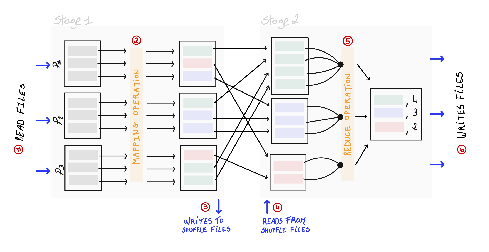

Apache Spark is an in-memory processing and analytics engine designed to be particularly efficient to process Big Data. You can use Spark on an on-premise or a cloud-deployed Hadoop cluster or through the Databricks platform. In any of these setups, using Spark efficiently is critical if you want to control and reduce costs. For that you should be able to diagnose and resolve some common performance issues. These usually fall into the five following categories: spill, skew, shuffle, storage and serialization. Here we are going to go over each of them to understand what they are, see how to identify them and mitigate their impact on your workflow.

## Skew

### Definition and root causes

In Spark, data is distributed across a cluster as partitions that are processed by different worker nodes. Usually partitions are 128 MB sized and evenly distributed. In reality however, some of your partitions can have significantly more records than others. Typically you face data skewness when using `join` or `groupBy` operations using a key that is not evenly distributed. This is not a Spark specific problem but keep in mind that the distribution of the data dramatically impacts on the performance of distributed systems. Let's imagine that in your workflow your data ends up being partitioned as shown below:

<p></p>

As partition one (P<sub>1</sub>) is around four times bigger than the others, it takes four time as much time and requires four time as much RAM to process P<sub>1</sub>. Consequently, the entire Spark job is slower. More specifically, the stage, including these tasks, takes as much time as the P<sub>1</sub> processing task. Finally, when P<sub>1</sub> does not fit in memory, Spark raises out-of-memory (OOM) errors or undergo some **spill** on disk, another issue described later.

### Monitoring skew

To monitor if your data is skewed, on the Spark UI go on the [Stages](https://spark.apache.org/docs/latest/web-ui.html#stages-tab) tab and read the timeline. If the tasks execution time is not evenly distributed and some task takes a dramatic amount of time compared to others, you data is skewed.

### Mitigating skew issues

Remember **skew is a data problem**. Several approaches exist to solve and mitigate it. Here three of them that you should consider when using Spark:

- Use the well-known "salting-key" strategy which briefly consists on concatenating the key with a random number. This randomizes the data and redistribute it more evenly.

- Use [query hints](https://spark.apache.org/docs/latest/sql-performance-tuning.html#join-strategy-hints-for-sql-queries) to annotate and help the optimizer engine to improve logical execution plans.

- Use the [Adaptive Query Execution](https://spark.apache.org/docs/latest/sql-performance-tuning.html#adaptive-query-execution) framework that shipped with Apache Spark 3.0 by enabling its features:

  ```java
  // Enable AQE and the adaptive skew join
  spark.conf.set("spark.sql.adaptive.enabled", true)
  spark.conf.set("spark.sql.adaptive.skewedJoin.enabled", true)
  ```

## Spill

### Definition and root causes

When the partitions are to big and cannot fit in memory, Spark moves the data on disk and gets it back later in memory. This phenomenon, called **spill**, is made possible thank to the [ExternalAppendOnlyMap](https://github.com/apache/spark/blob/master/core/src/main/scala/org/apache/spark/util/collection/ExternalAppendOnlyMap.scala) collection class. This prevents OOM errors when partitioned data is too big to fit in memory. Potentially expensive disk I/O operations arise as a trade-off from this operation. There are different scenarios where spill happens:

- Ingesting too large partitions.

- Aggregating tables on a skewed column.

- Using `join()`, `crossjoin()` or the `explode()` operations may create very large partitions.

- Using the `union()` operation. This operation takes two DataFrames and combine them into one and always use the same number of partitions that it started with. As depicted below we start with two DataFrame (DF1 & DF2) with a certain number of partitions and end up with the same number of concatenated partitions that are bigger.

  <p></p>

- Setting an inappropriate value (too big usually) to the `spark.sql.files.maxPartitionBytes` parameter (set to 128 MB by default). Our advice is to keep it at default and only alter it after some testing.

### Monitoring spill

To assess whether spill happened during your jobs, the easiest way is to go to the [Stages](https://spark.apache.org/docs/latest/web-ui.html#stages-tab) tab from the Spark U and read the **summary metrics** table for all completed tasks. There, spill is represented by two values:

- **Spill (Memory)**: this is the size of the data as it existed in memory
- **Spill (Disk)**: this is the size of the data as it existed in disk

> Please note two things: first, the Spill value in disks will be always lower than Spill value in memory due to compression. Second, if no spill occurred you won't find these values in the summary metrics table.

To know whether spill is occurring during the execution of your jobs, and not wait its end, use the `Spark.Listener` class in your code. A `SparkListener` object captures events from the Spark scheduler over the course of a Spark application execution (it is used to output the logs and metrics in the Spark UI). You can implement your own custom `SpillListener` to track spill. A very nice [example]( https://github.com/apache/spark/blob/master/core/src/main/scala/org/apache/spark/TestUtils.scala) can be found in the spark Github repository:

```java
// from https://github.com/apache/spark/blob/master/core/src/main/scala/org/apache/spark/TestUtils.scala

/**
 * A `SparkListener` that detects whether spills have occurred in Spark jobs.
 */
private class SpillListener extends SparkListener {
  private val stageIdToTaskMetrics = new mutable.HashMap[Int, ArrayBuffer[TaskMetrics]]
  private val spilledStageIds = new mutable.HashSet[Int]

  def numSpilledStages: Int = synchronized {
    spilledStageIds.size
  }

  override def onTaskEnd(taskEnd: SparkListenerTaskEnd): Unit = synchronized {
    stageIdToTaskMetrics.getOrElseUpdate(
      taskEnd.stageId, new ArrayBuffer[TaskMetrics]) += taskEnd.taskMetrics
  }

  override def onStageCompleted(stageComplete: SparkListenerStageCompleted): Unit = synchronized {
    val stageId = stageComplete.stageInfo.stageId
    val metrics = stageIdToTaskMetrics.remove(stageId).toSeq.flatten
    val spilled = metrics.map(_.memoryBytesSpilled).sum > 0
    if (spilled) {
      spilledStageIds += stageId
    }
  }
}
```

### Mitigating spill issues

A quick answer would be to add more memory to your cluster's workers. If not possible, decrease the size of each partition by increasing the number of partitions generated during data processing. In Spark you can:

- configure the default number of partitions.

  ```java
  spark.conf.set("spark.sql.shuffle.partitions", number_of_partitions)
  ```

- repartition the data with the `repartition()` method (be careful this is an expensive operation).

- configure the size of each partition with the `spark.sql.files.maxPartitionBytes` Spark setting.

- solve any issues related to skewed data first.

## Shuffle

### Definition and root causes

**Shuffle** occurs when Spark needs to regroup data from different partitions to compute a final result. It is a side effect observed with wide transformations. These include for example the `groupBy()`, `distinct()` or `join()` operations. Let's explain shuffle by going through a quick and simple example involving a `groupBy()` combined with a `count()` operation.

<p></p>

First the data is read from source (i.e., HDFS, cloud storage, previous stage) *(1)*. At stage 1, Spark performs a **"mapping"** operation to identify which record belongs to which group *(2)*. Then data is prepared for the next partitions and **written on disk in shuffle files** *(3)*. For the next stage, data is **read from the shuffle files** and transferred through the network to the next executors *(4)* where a **"reduce"** operation is performed. Our final result is computed *(5)* and data written on disk *(6)*.

Shuffle is a potentially very expensive operation that involves a lot of disk and network I/O which impact on Spark performance. Additionally, keep in mind that whatever type of wide transformations you are executing, the mapping and the reduce operations are performed in-memory and remain susceptible to some spill on disk which will add to the overhead of disk I/O.

### Monitoring shuffle

The Spark UI is useful to get some statistics about the shuffled data in the [Stages](https://spark.apache.org/docs/latest/web-ui.html#stages-tab) tab. In the summary metrics table, have a look to the following entries:

- **Shuffle Read Size / Records**: this the total of shuffle bytes read locally or from remote executors.
- **Shuffle Remote Reads**: this is the total of shuffle bytes read only from remote executors.
- **Shuffle Read Blocked Time**: this the time spent awaiting for shuffle data to be read from remote executors.

While these numbers are interesting, there are no conventional threshold. It depends on your data and the way you process it. Reducing the amount of shuffle is something you should target but keep in mind that shuffle is a necessary evil. With the Spark UI, you can identify the most expensive tasks and try to reduce shuffle in these cases. Check also if data is not skewed (watch the timeline) or if spill occurred before focusing on shuffle. Finally knowing how to mitigate it properly should permit you to keep these metrics below acceptable thresholds.

### Mitigating shuffle issues

There are different approaches against shuffle:

- to reduce the network I/O, design your cluster by favoring fewer but larger workers. This limits the number of machines where the data is shuffled across.

- to reduce the amount of data being shuffled, filter out columns or unnecessary records for your processing and analysis.

- to optimize join queries, when the size of one DataFrame is small (below 10 MB), Spark uses Broadcast joins (see the  `spark.sql.autoBroadcastJoinThreshold`, in the [documentation](https://spark.apache.org/docs/latest/sql-performance-tuning.html)). But be careful with it and be sure to have enough memory on the driver as smallest partitions are processed there.

- to optimize joins, use **bucketing** (`spark.sql.sources.bucketing.enabled` is set to true by default). Bucketing is an optimization technique to pull down data into distinct manageable parts named "buckets". Use the `bucketBy()` [method](https://spark.apache.org/docs/latest/api/scala/org/apache/spark/sql/DataFrameWriter.html) to bucket your data based on specific columns. Notably bucketing your data by sorted keys permits to avoid expensive shuffle operations.

- to reduce the shuffle behavior you can edit several spark configuration [properties](https://spark.apache.org/docs/3.0.0-preview2/configuration.html#shuffle-behavior). You should not blindly play with these but rather test your changes before going into production. We advise the reader to focus on the following properties to limit shuffle and expensive I/O activity:

  | Configuration                         | Description and recommendation                               |
  | ------------------------------------- | ------------------------------------------------------------ |
  | `spark.driver.memory`                 | The default value is 1GB. This is the amount of memory allocated to the Spark driver to receive data from executors. You can change while submitting a spark job with the `spark-submit` command. Increase the value if you expect the driver to process more a great amount of data notably in the context of a broadcast join. |
  | `spark.shuffle.file.buffer`           | The default value is 32 KB. If your workload increased, set it to larger values (1 MB). The more you have the more Spark will buffer your data before writing mapping result on disk. |
  | `spark.file.transferTo`               | Set to `true` by default. Set it to false if you want Spark to use the file buffer before writing on disk. This decrease the I/O activity. |
  | `spark.io.compression.lz4.block.Size` | The default value is 32 KB. By increasing it you can decrease the size f the shuffle file (don't go over 1 MB). By default Spark uses lz4 compression but you can change the compression codec by altering the property `spark.io.compression.codec` |

## Storage

### Definition and root causes`Stages`

When talking about the impact of storage on performance, we talk about the overhead I/O cost of data ingestion. The most common example relate to:

- **reading tiny files**

  The "tiny files problem" has been pinpointed and described since the existence of distributed system like [Hadoop](https://blog.cloudera.com/the-small-files-problem/). Things are similar with Spark. Before executing any query on your data, Spark will assess how many tasks are required to read the input data and determine on which worker it should schedule these tasks. Moreover, some files contain metadata (i.e., ORC, Parquet...)  to be read and parsed. Then with a huge number of small files, you increase the workload on the Spark Scheduler, number of read / close file operations and metadata to parse. Collectively these operations greatly impact on Spark performance.

- **scanning repositories**

  Directory scanning adds overhead to the tiny files problem. But it also exists for terabytes files especially in the context of highly partitioned datasets on disks. For each partition you have one directory. If we consider some data partitioned by year, month day and hour we will have 8640 directories to scan! If you let your data scale for 10 years you will end with 86400 directories. Keep in mind that the Spark driver scan the repository one at the time.

- **dealing with dataset schemas**

  inferring schema with Spark for `csv` and `json` files also impairs performance in Spark. Indeed it requires to do a full scan of the data to assess all types. In contrast, Spark only reads one file when dealing with the Parquet format. This is under the assumption that all Parquet files under the same partition have the same schema. But be careful if you wish to support Parquet schema evolution. For each new schema evolution, you have a new partition with new files. If you alter the schema a lot you progressively fall into the scanning issue as described before. By default, schema evolution is disabled in Spark 2 & 3 but if you need it use the `spark.sql.parquet.mergeSchema`  [property](https://spark.apache.org/docs/latest/sql-data-sources-parquet.html#schema-merging).

### Monitoring storage

On the Spark UI you have access to some interesting metrics to monitor file scanning and count:

- In the [Stages](https://spark.apache.org/docs/latest/web-ui.html#stages-tab) tab when looking at the stage details, have a look to the **Input Size / Records** metrics which gives you an idea about the total amount of data that is ingested versus the number of records.
- In the [SQL](https://spark.apache.org/docs/latest/web-ui.html#sql-tab) tab,  select your job and stage to have access to more details as the total **number of files read**, **scan time total** and **filesystem read time (sampled) total (min, med, max**).

### Mitigating storage issues

Measures to mitigate these issues are pretty simple:

- avoid using tiny files if possible, or merge them into bigger files before performing any operations on your data.
- keep in mind that the reading / scanning problem cannot be solved by adding more resources to your workers. Everything is handled by the driver.
- partition your data according to your needs. Avoid over-partitioning, if not necessary, although this will depend on the data problem you are tackling.

## Serialization

### Definition and root causes

Serialization improves performance on distributed applications by converting code objects and data into a stream of bytes and *vice-versa*. For distributed systems like Spark, the **majority of the compute time is spent on data serialization**.

When writing and executing code, the Spark driver serializes the code, send it to the executors that deserialized the code to execute it. By default, Spark uses Java serialization with the `ObjectOutputStream` framework that works with any types and classes that implement [`java.io.Serializable`](https://docs.oracle.com/javase/8/docs/api/java/io/Serializable.html). The [Kryo serialization](https://github.com/EsotericSoftware/kryo) permits to serialize data faster but is not compatible with every classes and types. You also need to do extra-work before to register the classes you want to be serialized.

At the beginning of Spark, users were mostly dealing with resilient distributed datasets (RDDs) by writing empiric code which describes how you want to do things. For RDDs, Spark uses Java serialization to serialize individual Scala and Java objects. **This process is expensive** especially because the Java objects model is highly memory consumptive. This is even more expensive with Pyspark where code and data are serialized / deserialized twice: first to Java/Scala and then to Python.

> Note: For PySpark all data that come to and from a Python executor has to be passed through a socket and a Java Virtual Machine (JVM) worker. Briefly, with PySpark, the `SparkContext` uses `Py4J` to launch a JVM to create a `JavaSparkContext`. That is the communication between `Py4J` and the JVM that orchestrate the data flow. It is worth noting that Py4J calls have pretty high latency. That is why all operations on RDDs takes much more time on PySpark than on Spark.

The project Tungsten in 2004 and the design of the DataFrame API were critical steps towards performances improvement of the Spark engine. The first altered and improved the Java objects model allowing Spark to manage data expressed as DataFrame much more efficiently. The API permits us to write more declarative code that will be processed as instructions for the transformation chain. Both minimize the amount of work required by the Spark JVMs. And if you work with PySpark note that in this context nothing will be done in Python then excluding the double serialization needed with RDDs.

All these theoretical details are not easy to grasp but shed light on a very important aspect of Spark: **each time you will get away from the DataFrame API in your code, you will lose all these optimizations and encounter some performance hits.** This is notably the case when you:

- process manually RDDs (writing `map()` and / or `lambda` functions).
- use user-defined functions (UDFs) that are useful and easy-to-use to extend Spark SQL functionalities. However, UDFs are "black-box" and prevent several Spark optimization processes including the way Spark deals with Java objects. For example, using UDFs in PySpark will bring you back to the double serialization issue.

### Mitigating storage issues

Here the rules are simple:

- **USE THE DATAFRAME API**. Dig into the API to know exactly the possibilities offered to you.
- Use UDFs only when strictly necessary. By design Scala will be faster than Python when using UDFs. With Python however you can still give a try to the [pandas UDFS](https://spark.apache.org/docs/3.0.0/sql-pyspark-pandas-with-arrow.html#pandas-udfs-aka-vectorized-udfs) (also called vectorized UDFs) that use [apache Arrow](https://arrow.apache.org/) to give a performance boost to PySpark in this context.
- Give a try to the [Kryo serialization](https://github.com/EsotericSoftware/kryo) framework despite its limitations. You may benefit from its performance boost for your current data problem. It is actually the default framework used by Spark in [Apache Hudi](https://hudi.apache.org/docs/spark_quick-start-guide.html).

## Conclusion

Using Spark efficiently requires a good knowledge of its inner parts and an ability to identify technical and performance issues. Here we framed and articulated the five main problems that you may encounter and have discussed a number of techniques to bypass them and optimize your Spark applications. Noteworthy, do not take this article as a step-wise guide that will solve all your problems for all your situations. Instead, it should give you an idea of what is happening and what are the solutions you can implement based on your project. This lets a lot of rooms for experimentations and testing that are necessary to find the right and optimal balance for your Spark applications.
